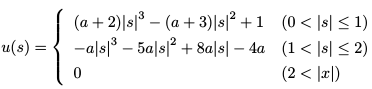
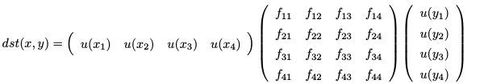
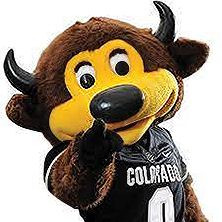
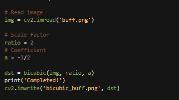
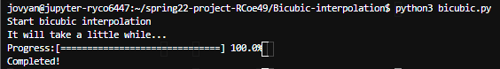

# Bicubic Interpolation - Ryan Coe
In this project I will be looking into the usage and appeal of the image interpolation software created by rootpine.

## What does it do?
The rootpine interpolation program takes in an image and resizes it based on the users specifications while keeping the native resolution. This is possible is via interpolation, using a matrix to interpolate the missing pixels and fill them in with an "educated guess."

#### Interpolation and Kernel used by rootpine:
  * Kernel
  
  
  
  
  * Interpolation
  
  
  
## Who are the stakeholders?
The nice thing about this piece of software is that is has a vast appeal. Image scaling is present in almost everything we do online or on our phones. If you are in the development field and you need an image that can be availible in different sizes on different platforms; image interpolation is sure to come in handy. The same goes for any field that deals with large graphics, if a customer submits an image with low resolution it makes much more sense to print out a larger interpolated image oppose to a resized image with terrible resolution.
Overall there are many different applications for image interpolation because in the end it is just a better way to resize an image.

## Metrics and Features
#### Parameters:
  * img - The desired image to resize
  * ratio - The multiple of size desired for the new image
  * a - The coeficient for pixel size
  
Much of the accuracy/condtioning is hard to determine because the output is an image, however I was able to determine a way to get images "accurate" to what I required. The sharpness of the image can be altered by both the ratio and a parameters. To get an image most similar to the original in resolution one must keep the a coeficient as the negitive inverse of the ratio. If the a coeficient is too large it will result in larger pixels unproportionate to the new image size, the opposite will also occur if the a coeficient is too small leaving you with an image that looks sharper but lacks accuracy up close.

#### Examples:
  * original
  
  

  * a too large
  
  
  
  * a too small
  
  
  
  * proportionate a
  
  
  
## Running the Program
The easiest way to run this program is to directly edit the bicubic.py file. In the file, towards the bottom, there is space to change the image, ratio and a coeficient, as well as the name of the new image that will be produced:

  

Once these specifications have been adjusted to your liking go into the terminal and type: python3 bicubic.py

Doing this will run the program and create a new image according to your inputs.

  
  
## Question/Experiment Proposal
My question is also the topic that I would like to conduct an experiment on: Is there an a coeficient that creates a more accurate image than the negitive inverse of ratio. I have not done any extensive testing yet but it seems that slightly lowering the a coefficent makes the image appear sharper. If I were doing a project on this I believe there are interesting discoveries to be made regarding the optimal a coefficent. We could meassure its accuracy by taking an image, shrinking it down without interpolation and then use the software to restore the image to its original size. After that we can compare the new image to the original pixel by pixel and get a real measurement of accuracy. Conducting tests like this on a number of images with changing a coeffiecints could help us discover the optimal value for the a coefficient.

## Note
Github wont let me push an edited repository inside of my own repo, the best I could do is push the original software github called Bicubic-interpolation1 in my repo.